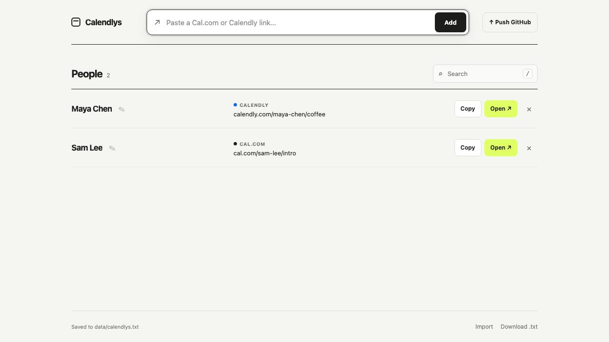

# Calendlys

Paste a friend’s Cal.com, Calendly, or other scheduling link and keep it locally. Calendlys derives the person’s name from the URL automatically—no form filling required.



Calendlys is a tiny local-first address book for scheduling links: paste a URL, get a readable name, search later, copy/open quickly, and optionally push the saved `.txt` file to GitHub.

## Features

- Paste a link directly in the header
- Automatically derives names such as `eliaspfeffer` → **Elias Pfeffer**
- Search, copy, open, and delete saved links
- Double-click a displayed name (or use the pencil button), edit it, and confirm with **Save** or Enter
- Saves through the local server to [`data/calendlys.txt`](data/calendlys.txt)
- **Push GitHub** commits that text file and pushes it to this repository with one click
- Browser `localStorage` fallback plus `.txt` import/download
- Plain HTML, CSS, JavaScript, and Python standard library; no runtime dependencies

## Run locally

```bash
python3 server.py
```

Then visit [http://127.0.0.1:4173](http://127.0.0.1:4173).

You can still open `index.html` directly, but local text-file saving and the GitHub button require `server.py`.

## Local file and GitHub sync

Adding, deleting, or importing links writes the current list to `data/calendlys.txt` while the local server is running. Clicking **Push GitHub** commits only that file and runs `git push origin HEAD` using your existing Git credentials.

> **Privacy:** Links pushed to a public repository become public. Keep the repository private if the list should stay private.

## Test

```bash
npm test
```

Calendlys has no account, analytics, external backend, or tracking.
